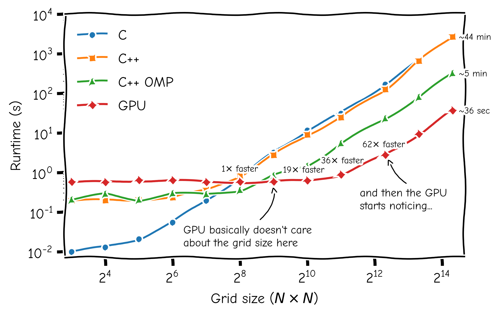

# Conway's Game of Life: C++/CUDA Implementation

## Description

This is the third version of Conways game of life used as a learning experience
into new languages or coding paradigms.

This implementation follows the same idea as version 2 
([golV2](https://github.com/JAMelendezD/GameofLifeV2)) but now written in C++
with a GPU kernel to see the difference in speed from a GPU-accelerated implementation.
This version also explores the use of a C-API and a interface to python using
`ctypes`.

To install the library first modify the `MakeFile` according to your needs. In
particular the compilers and the GPU compute capability. Then just type the 
following.

```
make all
```

This will create two versions inside of `lib` a CPU and GPU versions. Based on
compilation flags the CPU version can either be single thread or multithreaded
with openMP.

An example on how to load the library and run it in python is given inside the 
`python` directory. For example from the main directory.

```
python python/gameoflife.py --rows 50 --cols 100 --back CPU
```

The first flags correspond to the side of the grid and the last one to the 
backend to be used either CPU or GPU.

## Benchmarks

A comparison between the old C implementation to the newer C++, C++(OMP) and GPU.
These were run in a Legion Laptop AMD Ryzen 7 5800H (16 cores) and a RTX 3060
laptop version.

The benchmarks explore large grid sizes with a constant number of steps set to
1000. Printing to the terminal is turned off to remove any possible bottlenecks. 

<p align="center">
  
</p>

## Example

<p align="center">
  
</p>

